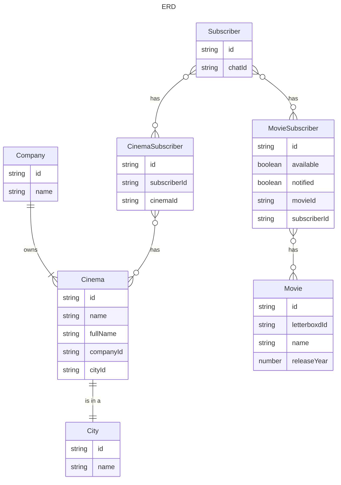

```mermaid
---
title: ERD
---
erDiagram
  City {
    string id

    string name
  }

  Company {
    string id

    string name 
  }

  Cinema {
    string id

    string name
    string fullName

    string companyId
    string cityId
  }

  Movie {
    string id

    string letterboxdId
    string name
    number releaseYear
  }

  Subscriber {
    string id
    string chatId
  }

  MovieSubscriber {
    string id

    boolean available
    boolean notified

    string movieId
    string subscriberId
  }

  CinemaSubscriber {
    string id

    string subscriberId
    string cinemaId
  }

  Company ||--|{ Cinema: owns
  Cinema ||--|| City: "is in a"

  Subscriber }o--o{ CinemaSubscriber: has
  CinemaSubscriber }o--o{ Cinema: has

  Subscriber }o--o{ MovieSubscriber: has
  MovieSubscriber }o--o{ Movie: has
```